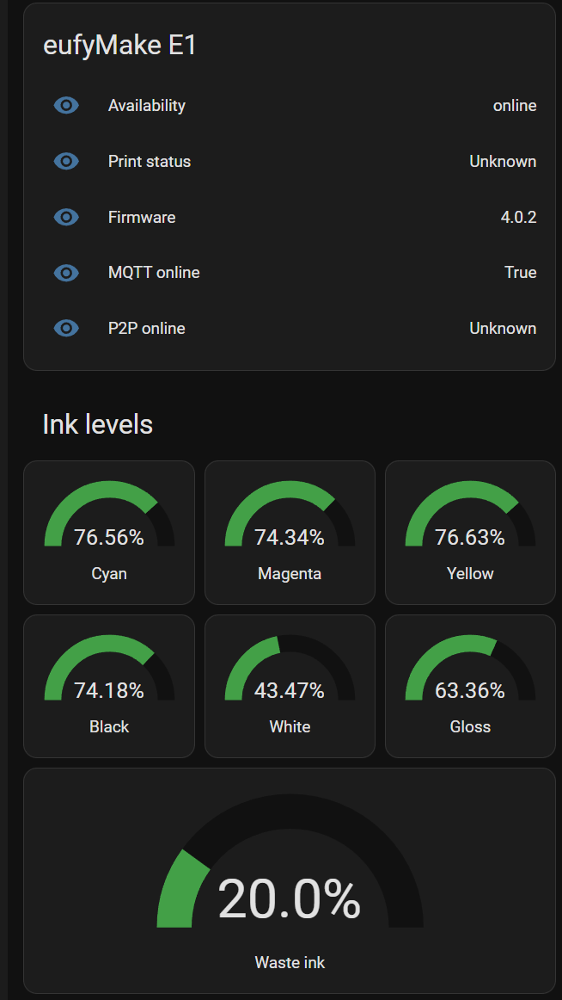

# eufyMake E1 for Home Assistant

[](https://my.home-assistant.io/redirect/hacs_repository/?owner=Briadark&repository=eufymake-home-assistant&category=integration)

Custom Home Assistant integration for the eufyMake E1 UV printer.

This integration is experimental and read-only. It connects through the
eufyMake cloud MQTT path and exposes printer status as Home Assistant sensors.

## Features

- Setup from the Home Assistant integrations UI.
- eufyMake account login with country dropdown, email, password, and captcha
  support.
- Sensors for availability, firmware, current accessory, connectivity, ink
  levels, ink expiration, and waste ink.
- Bundled MQTT certificate, so no certificate file from the Windows app is
  needed.

## Compatibility

Supported:

- eufyMake E1, station model `V8260`

Not supported:

- AnkerMake M5 / eufyMake Studio 3D printer, station model `V8111`.
  Support may be added later.

## Install With HACS

1. Make sure HACS is installed in Home Assistant.
2. Click the HACS button above.
3. Add this repository as an `Integration`.
4. Download `eufyMake E1`.
5. Restart Home Assistant.
6. Go to Settings -> Devices & services -> Add integration.
7. Search for `eufyMake E1`.

## Setup

Enter your eufyMake account details:

- Country
- Email
- Password

If eufyMake asks for captcha verification, Home Assistant shows the captcha
image and asks for the answer before continuing.

Your password is used only during setup and is not stored in the Home Assistant
config entry.

## Dashboard Example

This example uses only built-in Home Assistant cards. If Home Assistant created
different entity IDs for your printer, replace the entity IDs below with your
own.



```yaml
type: vertical-stack
cards:
  - type: entities
    title: eufyMake E1
    show_header_toggle: false
    entities:
      - entity: sensor.eufymake_e1_availability
        name: Availability
      - entity: sensor.eufymake_e1_print_status
        name: Print status
      - entity: sensor.eufymake_e1_firmware_version
        name: Firmware
      - entity: sensor.eufymake_e1_current_accessory
        name: Current accessory
      - entity: sensor.eufymake_e1_mqtt_online
        name: MQTT online
      - entity: sensor.eufymake_e1_p2p_online
        name: P2P online

  - type: grid
    title: Ink levels
    columns: 3
    square: false
    cards:
      - type: gauge
        entity: sensor.eufymake_e1_cyan_ink
        name: Cyan
        min: 0
        max: 100
        needle: false
        severity:
          red: 0
          yellow: 15
          green: 30

      - type: gauge
        entity: sensor.eufymake_e1_magenta_ink
        name: Magenta
        min: 0
        max: 100
        needle: false
        severity:
          red: 0
          yellow: 15
          green: 30

      - type: gauge
        entity: sensor.eufymake_e1_yellow_ink
        name: Yellow
        min: 0
        max: 100
        needle: false
        severity:
          red: 0
          yellow: 15
          green: 30

      - type: gauge
        entity: sensor.eufymake_e1_black_ink
        name: Black
        min: 0
        max: 100
        needle: false
        severity:
          red: 0
          yellow: 15
          green: 30

      - type: gauge
        entity: sensor.eufymake_e1_white_ink
        name: White
        min: 0
        max: 100
        needle: false
        severity:
          red: 0
          yellow: 15
          green: 30

      - type: gauge
        entity: sensor.eufymake_e1_gloss_ink
        name: Gloss
        min: 0
        max: 100
        needle: false
        severity:
          red: 0
          yellow: 15
          green: 30

  - type: gauge
    entity: sensor.eufymake_e1_waste_ink
    name: Waste ink
    min: 0
    max: 100
    needle: false
    severity:
      green: 0
      yellow: 70
      red: 90

  - type: entities
    title: Ink expiration
    show_header_toggle: false
    entities:
      - entity: sensor.eufymake_e1_cyan_ink_expiration_date
        name: Cyan expiration
      - entity: sensor.eufymake_e1_cyan_ink_days_until_expiration
        name: Cyan days left
      - entity: sensor.eufymake_e1_magenta_ink_expiration_date
        name: Magenta expiration
      - entity: sensor.eufymake_e1_magenta_ink_days_until_expiration
        name: Magenta days left
      - entity: sensor.eufymake_e1_yellow_ink_expiration_date
        name: Yellow expiration
      - entity: sensor.eufymake_e1_yellow_ink_days_until_expiration
        name: Yellow days left
      - entity: sensor.eufymake_e1_black_ink_expiration_date
        name: Black expiration
      - entity: sensor.eufymake_e1_black_ink_days_until_expiration
        name: Black days left
      - entity: sensor.eufymake_e1_white_ink_expiration_date
        name: White expiration
      - entity: sensor.eufymake_e1_white_ink_days_until_expiration
        name: White days left
      - entity: sensor.eufymake_e1_gloss_ink_expiration_date
        name: Gloss expiration
      - entity: sensor.eufymake_e1_gloss_ink_days_until_expiration
        name: Gloss days left
      - entity: sensor.eufymake_e1_waste_ink_expiration_date
        name: Waste ink expiration
      - entity: sensor.eufymake_e1_waste_ink_days_until_expiration
        name: Waste ink days left
```

## Notes

This project is not affiliated with eufyMake, AnkerMake, or Anker.

Do not share Home Assistant diagnostics, logs, or local cache exports publicly
unless you have checked that they do not contain tokens, serial numbers, or
device keys.
